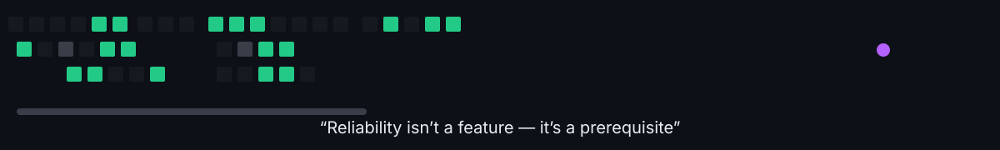
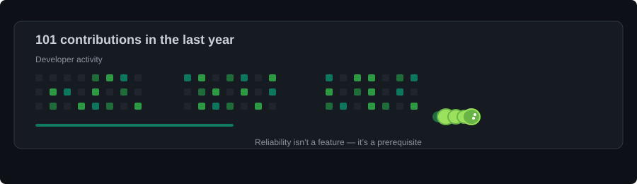

# Noe Santiago

### Ingeniería de Sistemas · Full-Stack Developer · AI & Automation

**Universidad Nacional de San Cristóbal de Huamanga — UNSCH**
📍 Ayacucho, Perú 🇵🇪

---

## 👨‍💻 Sobre mí

Estudiante de **Ingeniería de Sistemas** en la **UNSCH**, enfocado en el desarrollo de software, inteligencia artificial y automatización de procesos. Me interesa construir **sistemas útiles, escalables y orientados a resolver problemas reales** mediante tecnología, datos y buenas prácticas de ingeniería.

- 🔭 Actualmente trabajando en proyectos de **Full-Stack, AI y automatización**
- 🌱 Aprendiendo **Arquitectura de Software, Cloud y Testing**
- 🎯 Objetivo: generar impacto tecnológico en la región **Ayacucho y el Perú**
- 🤝 Abierto a colaboraciones en proyectos open-source e investigación

---

## 🛠️ Stack Tecnológico

**Lenguajes**

**Frameworks & Librerías**

**IA & Data**

**Bases de Datos**

**DevOps & Herramientas**

---

## 🚀 Áreas de Trabajo

<table align="center">
  <tr>
    <td align="center" width="25%">
      <h3>💻 Full-Stack</h3>
      
Aplicaciones web y sistemas de software

    </td>
    <td align="center" width="25%">
      <h3>🐍 Python</h3>
      
Backend, automatización y manejo de datos

    </td>
    <td align="center" width="25%">
      <h3>🤖 IA</h3>
      
Computer Vision, LLMs y RAG

    </td>
    <td align="center" width="25%">
      <h3>⚙️ Automatización</h3>
      
Procesos repetitivos convertidos en software

    </td>
  </tr>
</table>

---

## 📚 Actualmente Aprendiendo

---

## 📊 GitHub Activity

  

  

---

## 🎓 Formación Académica

**🎓 Ingeniería de Sistemas**
Universidad Nacional de San Cristóbal de Huamanga — UNSCH
📍 Ayacucho, Perú 🇵🇪

---

## 📌 Proyectos Destacados

| Proyecto | Descripción | Stack |
|----------|-------------|-------|
| 🔹 [Proyecto 1](https://github.com/santiago-noe) | Breve descripción del proyecto | Python · FastAPI |
| 🔹 [Proyecto 2](https://github.com/santiago-noe) | Breve descripción del proyecto | React · Node.js |
| 🔹 [Proyecto 3](https://github.com/santiago-noe) | Breve descripción del proyecto | PyTorch · PostgreSQL |

> 💡 Reemplaza cada fila por tus repositorios reales con enlace y descripción.

---

### 💬 *"Building software. Learning continuously. Solving real problems."*

 

